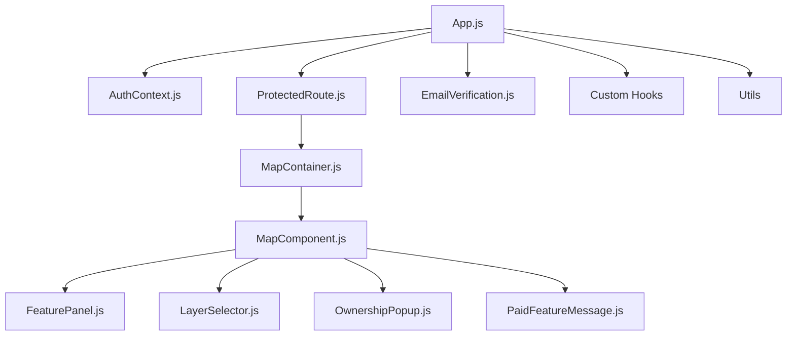

# High-Level Design (HLD)

## 1. Overview
This project is a React-based web application for OTP-verified user authentication and map-based features. It uses React Context for authentication, React Router for routing, and Leaflet for map rendering.

## 2. Main Modules
- **App.js**: Root component, sets up routing and context providers.
- **components/UI/**: Contains all major UI components and feature modules.
- **components/hooks/**: Custom React hooks for encapsulating logic.
- **components/utils/**: Utility functions for map and feature processing.
- **public/**: Static assets and HTML template.

## 3. Key Flows
- **Authentication**: Users must verify via OTP to access protected routes (e.g., `/map`).
- **Map Features**: Authenticated users can interact with map layers, feature panels, and popups.
- **Email Verification**: Handles email/phone validation and OTP flow.

## 4. Main Technologies
- React, React Router, React Context
- Leaflet (for maps)
- Axios (for HTTP requests)
- Tailwind CSS (for styling)

## 5. Architecture Diagram

